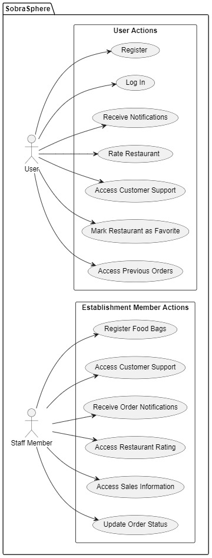
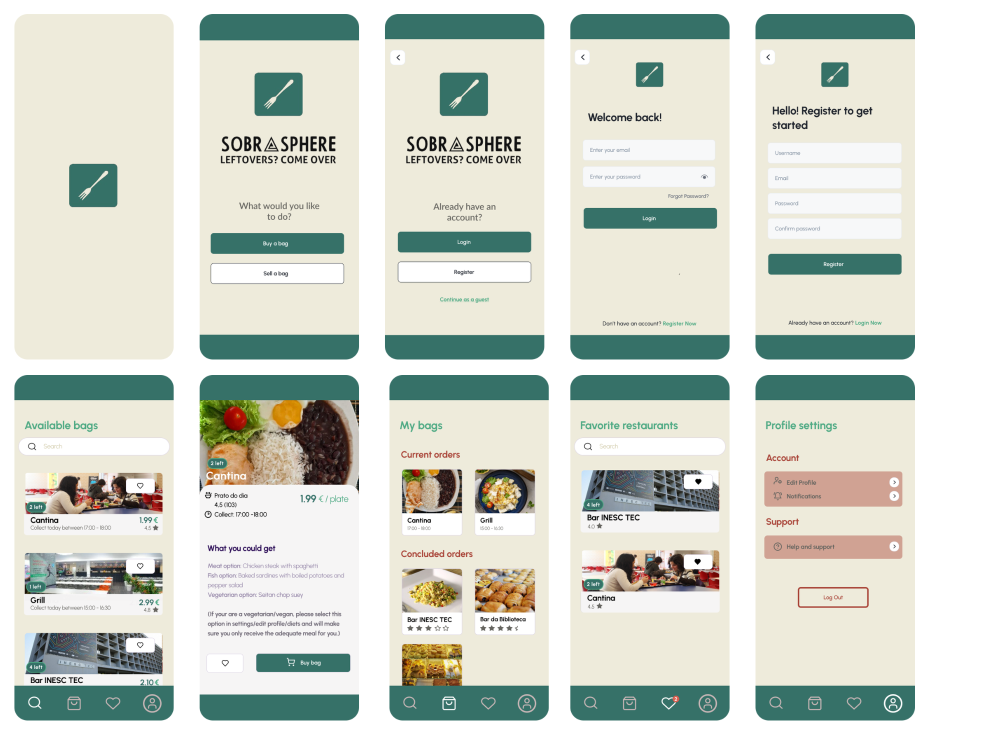
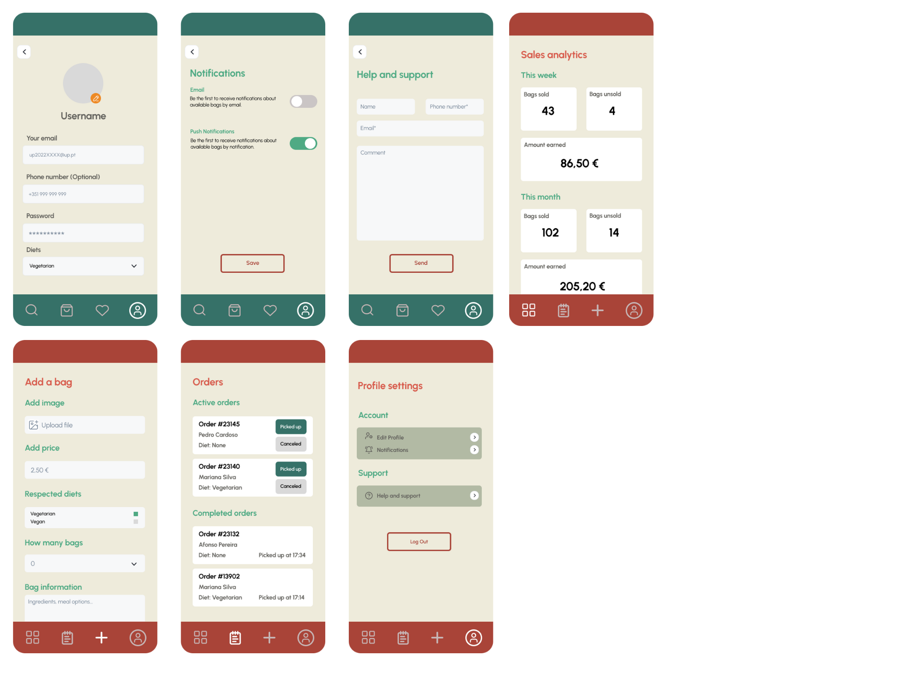
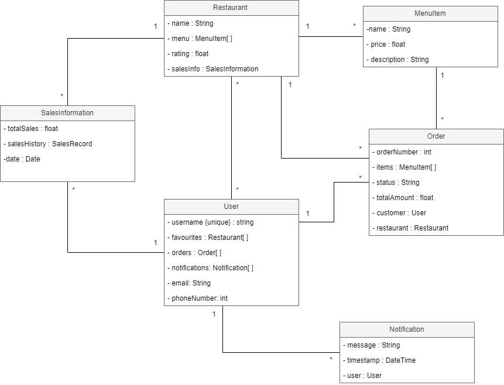
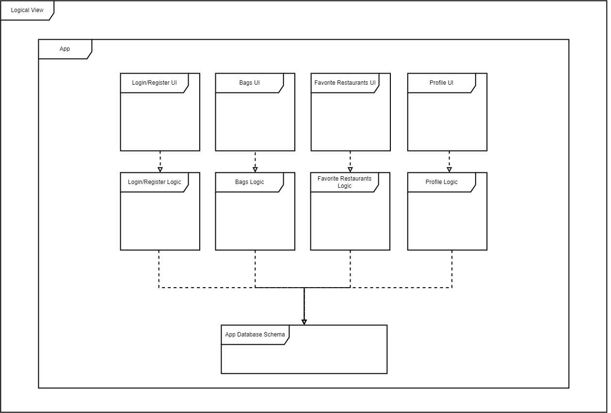
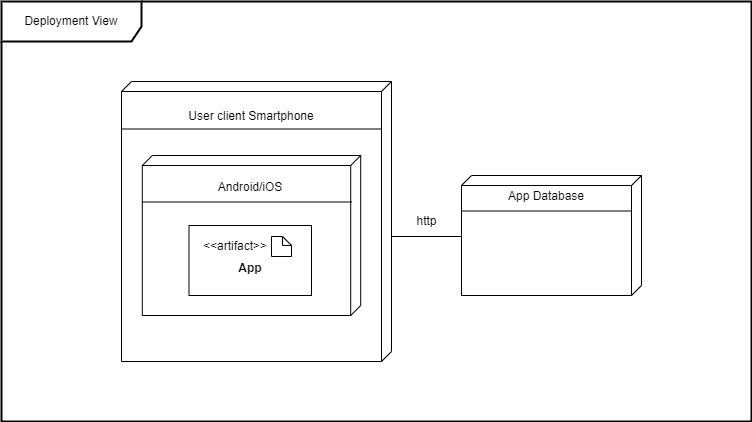

# _SOBRA SPHERE_ Development Report

Welcome to the documentation pages of the _SOBRA SPHERE_!

You can find here details about the _SOBRA SPHERE_, from a high-level vision to low-level implementation decisions, a kind of Software Development Report, organized by type of activities: 

- [_SOBRA SPHERE_ Development Report](#sobra-sphere-development-report)
  - [Business Modelling](#business-modelling)
    - [Product Vision](#product-vision)
    - [Features and Assumptions](#features-and-assumptions)
    - [Elevator Pitch](#elevator-pitch)
  - [Requirements](#requirements)
    - [Domain model](#domain-model)
  - [Architecture and Design](#architecture-and-design)
    - [Logical architecture](#logical-architecture)
    - [Physical architecture](#physical-architecture)
    - [Vertical prototype](#vertical-prototype)
  - [Project management](#project-management)

Contributions are expected to be made exclusively by the initial team, but we may open them to the community, after the course, in all areas and topics: requirements, technologies, development, experimentation, testing, etc.

Please contact us!

Thank you!

*Gonçalo Carvalho - up202204873@edu.fe.up.pt* 
*Gonçalo Sousa - up202207320@edu.fe.up.pt* 
*Guilherme Coelho - up202000141@edu.fc.up.pt* 
*João Castro - up202206575@edu.fe.up.pt* 
*Manoela Américo - up202201391@edu.fe.up.pt* 

---
## Business Modelling

### Product Vision

Our app is the bridge between U.Porto's eateries and its community, transforming surplus into savings and pioneering a sustainable, zero-waste dining culture on campus.

### Features and Assumptions

- Are you a customer or establishment staff? - Before accessing any feature of the app, the user will have to identify if it's a customer(students, professors, staff) or if it intends to sell food in the app.
- Login or create an account- First-time users must create an account to access the app.
- Recover password
- Edit profile
- Favorite restaurants - List of the user's favorite places to eat on campus (create an option to get notifications when the restaurant realizes "bags")
- Secure payment
- My orders - Orders already purchased which are waiting to be picked up.
- Available "bags of food" at the moment
- Search for restaurants
- Create food bag sales - only available to establishment staff accounts
- Customer support
- Rate a restaurant
- Information about sales - only available to establishment staff accounts

### Elevator Pitch
Have you ever wondered what happens with the food that slurps from your campus restaurants?
SobraSphere connects campus establishments with surplus food directly to FEUP's students and staff at reduced prices. This way, customers would be able to collect surprise bags with diverse products at an affordable price while helping to prevent food waste. In the app, you're also able to rate the bags you order and receive notifications from your favorite restaurants around the campus. Waste no time (and food) and download our app now!

## Requirements

**Use Case**
 
A brief Use Case Diagram of our project:

  

**User interface mockups**.

  

  

link do figma: https://www.figma.com/file/Zw26zCuW5si7jc8vs5vg93/FEUP-LEIC-ES-2023-24%2F2LEIC10T3?type=design&node-id=112%3A728&mode=design&t=5QOCeIBEMXhSucFd-1

**Acceptance tests**.
By clicking [here](https://github.com/FEUP-LEIC-ES-2023-24/2LEIC10T3/blob/d188837abe4f0159ce54598572517f2cf0ee384f/docs/Acceptance_tests.md) you can see our acceptance tests

**Unit Tests**
By clicking [here](https://github.com/FEUP-LEIC-ES-2023-24/2LEIC10T3/blob/06da76d891c8277e4a1f370af7aec3d4ae517fe9/sobra_sphere/test/widget_test.dart) you can see our unit tests.
### Domain model

  
  
 Here is a short description of each class: 
- Restaurant: A class representing a restaurant with properties such as name, menu items, price, rating, description, sales information, and more. 
- MenuItem: A class representing a menu item with properties like name, menu category, price, and rating. 
- SalesInformation: A class representing sales information with properties like total sales, date, and sales records. 
- User: A class representing a user with properties like username, sales history, restaurants, favorites, orders, food bags, notifications, email, and phone number. 
- Order: A class representing an order with properties like order number, items, status, total amount, customer, and restaurant. 

## Architecture and Design

### Logical architecture

  

### Physical architecture

  

### Vertical prototype

Please click [here](https://github.com/FEUP-LEIC-ES-2023-24/2LEIC10T3/blob/33eb7be270082cc3545634b49b85bc4161ad66b9/images/Vertical%20prototype/vertical_prototype.md).

<h3> UI Implementation </h3>

In this prototype, the main goal was to recreate the UI wondered on the Mockups, giving the app the aspect we wanted without implementing (yet) most of the functional part. For this, we used FlutterFlow with further adjustments on the code and the Figma project we made as a base.  

<h3>Authentication and Firebase Usage</h3>

We also implemented the Registration and Log In functionality on our app. To that end, we turn to Firebase and Google Email Authentication Services. We created a "user" collection to store all the data from the user's registration. This allowed us to make sure only registered users can log in to our app and use our services

## Project management

  -[Sprint 1](https://github.com/FEUP-LEIC-ES-2023-24/2LEIC10T3/blob/bc069a54ea0b1af4844cdc37ca90396e109b4488/docs/project_management/sprint1.md).
  
  -[Sprint 2](https://github.com/FEUP-LEIC-ES-2023-24/2LEIC10T3/blob/bc069a54ea0b1af4844cdc37ca90396e109b4488/docs/project_management/sprint2.md).

  -[Sprint 3](https://github.com/FEUP-LEIC-ES-2023-24/2LEIC10T3/blob/bc069a54ea0b1af4844cdc37ca90396e109b4488/docs/project_management/sprint3.md).

## Test 

You can register as a regular user, but if you to use a staff account, you can use this account: email: sobrasphere@gmail.com and the password is 'SobraSphere123'.
